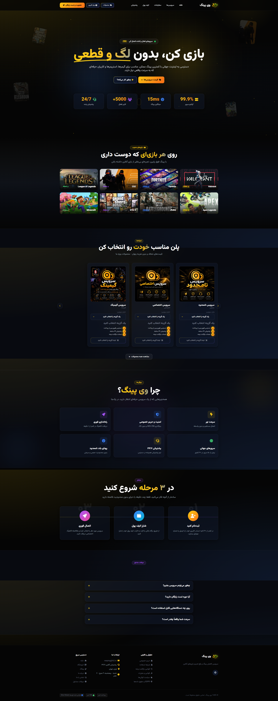

# VeePing WordPress Theme

[](https://wordpress.org/)
[](https://www.php.net/)
[](https://woocommerce.com/)
[](https://tailwindcss.com/)
[](https://alpinejs.dev/)
[](https://developer.wordpress.org/themes/functionality/localization/)
[](LICENSE)

A modern, RTL-first WordPress theme built for **VeePing** — a service platform focused on internet connectivity, gaming, digital services, and online products.

The theme combines a dark/neon visual system with **Tailwind CSS**, **Alpine.js**, native WordPress customization, and deep **WooCommerce** integration for digital-first stores.

> Designed for Persian websites where visual polish, RTL support, WooCommerce compatibility, performance, and a smooth mobile experience all matter.

---

## ✨ Highlights

- 🎨 Dark, glassmorphism-inspired UI with neon accents
- 🇮🇷 Persian-first RTL layout and **Vazirmatn** typography
- 🛒 Deep WooCommerce integration for digital products and services
- ⚡ Quick-buy flow with AJAX and variation support
- 📱 Responsive navigation and mobile-oriented UI
- ✨ Animated UI effects, reveal animations, counters, particles, parallax, and interactive cards
- 🚀 Performance-focused asset loading and frontend cleanup
- 🔐 Built-in security hardening helpers
- 🧩 WordPress Customizer controls for contact, social links, hero content, footer, badges, and copyright
- 📰 Blog, archive, search, 404, page, and single-post templates
- 🔎 Breadcrumb navigation and reusable template parts
- 🖼️ Game/service showcase sections with bundled assets
- 🧱 Tailwind CSS source with PostCSS build pipeline
- 📦 Production-ready minified CSS and JavaScript assets

---

## 🖥️ Frontend Experience

The homepage is built as a full landing-page experience with sections such as:

- Hero / introduction
- Gaming statistics
- Supported game showcase
- Pricing carousel
- Feature overview
- How it works
- FAQ
- Testimonials / social proof
- Responsive mobile navigation

The visual system uses glass cards, neon highlights, animated backgrounds, hover interactions, scroll reveals, counters, particles, parallax elements, and magnetic/ripple button effects.

---

## 🛒 WooCommerce Integration

VeePing Theme is designed around a **digital-product / digital-service WooCommerce workflow** rather than a traditional physical store.

Included integrations and customizations include:

- Custom WooCommerce theme support
- 3-column shop layout
- 9 products per shop page
- Replacement of the default WooCommerce frontend stylesheet
- Digital-first checkout flow without shipping requirements
- Custom checkout fields
- Reduced address requirements
- Single-quantity product behavior
- Cart cleanup action before checkout
- AJAX quick-buy from homepage pricing cards
- Variable-product support in quick-buy
- Nonce validation for AJAX quick-buy and cart actions
- Dedicated shop sidebar with product categories
- WooCommerce product gallery zoom, lightbox, and slider support
- Special handling for wallet top-up products

> The full WooCommerce feature set requires WooCommerce to be installed and activated.

---

## ⚡ Performance

The theme includes several frontend and WordPress-level optimizations intended to reduce unnecessary work and improve page delivery.

### Asset loading

- Alpine.js and the theme application script are deferred.
- Vazirmatn and Font Awesome are loaded using preload/async stylesheet swapping.
- Resource hints are added for external CDNs.
- WordPress embed and Heartbeat assets are removed from the public frontend where they are not needed.
- Dashicons are removed for logged-out visitors.
- Unused block styles are conditionally dequeued.
- WooCommerce cart fragments are removed outside the cart page because the theme does not rely on a header AJAX mini-cart.
- Static asset version query strings are removed from frontend CSS/JS URLs.

### Query / WordPress optimizations

- Post revisions are limited to **5**.
- Autosave interval is increased to **120 seconds**.
- Self-pingbacks are disabled.
- Featured WooCommerce product IDs used by the homepage are cached in a WordPress transient for **12 hours** and invalidated when relevant product data changes.

These optimizations are intentionally implemented inside the theme so the project remains relatively lightweight and does not depend on a large optimization plugin stack.

---

## 🔐 Security Hardening

The theme includes several defensive measures at the theme level, including:

- XML-RPC disabled
- WordPress generator/version exposure reduced
- Security-related HTTP response headers
- Strict referrer policy
- Permissions Policy restricting camera, microphone, and geolocation
- HSTS header when HTTPS is enabled
- Login error message hardening
- `noopener` / `noreferrer` handling for external `_blank` links
- WordPress nonce validation for custom AJAX actions
- Input sanitization and escaped output throughout custom functionality

> Theme-level hardening is not a replacement for server security, a properly configured firewall, updates, strong authentication, or a dedicated security plugin where appropriate.

---

## ⚙️ Customizer

Several site-level settings are exposed through the native WordPress Customizer.

### Contact information

- Email
- Phone number

### Social networks

- Telegram
- Instagram
- Twitter/X
- YouTube
- Discord

### Homepage Hero

- Custom Hero description

### Footer

- Custom footer HTML
- Trust badges
- Badge links
- Copyright text

This allows common branding/content changes without modifying template files.

---

## 🧱 Tech Stack

| Technology | Purpose |
|---|---|
| WordPress | CMS / theme platform |
| PHP | Theme logic and WordPress integration |
| WooCommerce | Store, checkout, products, and digital services |
| Tailwind CSS 3 | Utility-first styling |
| PostCSS | CSS processing pipeline |
| Autoprefixer | CSS compatibility |
| cssnano | Production CSS minification |
| Terser | JavaScript minification |
| Alpine.js 3 | Lightweight frontend interactions |
| Vazirmatn | Persian UI typography |
| Font Awesome 6 | Icons |

---

## 📁 Project Structure

```text
veeping-theme/
├── assets/
│   ├── css/
│   │   ├── input.css          # Tailwind source
│   │   ├── theme.css          # Generated development CSS
│   │   └── theme.min.css      # Production CSS
│   ├── images/
│   │   ├── games/             # Game artwork
│   │   └── logo.png
│   └── js/
│       ├── app.js             # Frontend source
│       └── app.min.js         # Production JS
├── includes/
│   ├── comments.php
│   ├── customizer.php
│   ├── helpers.php
│   ├── performance.php
│   ├── scripts.php
│   ├── security.php
│   ├── setup.php
│   └── woocommerce.php
├── template-parts/
│   ├── content-none.php
│   ├── content-page.php
│   ├── content-single.php
│   └── content.php
├── 404.php
├── archive.php
├── comments.php
├── footer.php
├── front-page.php
├── functions.php
├── header.php
├── index.php
├── page.php
├── search.php
├── single.php
├── single-product.php
├── style.css
├── woocommerce.php
├── package.json
├── postcss.config.js
└── tailwind.config.js
```

---

## 🚀 Installation

### Option 1 — WordPress admin

1. Download the theme ZIP.
2. Open **WordPress → Appearance → Themes → Add New → Upload Theme**.
3. Upload the ZIP file.
4. Install and activate **VeePing**.
5. Install and activate **WooCommerce** if you need the store / digital-service functionality.
6. Configure menus, logo, widgets, WooCommerce pages, and the Customizer settings.

### Option 2 — Manual installation

Copy the theme into:

```text
wp-content/themes/veeping-theme/
```

Then activate it from:

```text
WordPress Dashboard → Appearance → Themes
```

---

## 🛠️ Development Setup

Node.js and npm are only required if you want to modify the Tailwind/CSS/JavaScript source files.

### 1. Clone the project

```bash
git clone https://github.com/sinahinson/VeePing-theme.git
cd VeePing-theme
```

### 2. Install dependencies

```bash
npm install
```

### 3. Build production assets

```bash
npm run build
```

The build command processes:

```text
assets/css/input.css → assets/css/theme.css
assets/css/input.css → assets/css/theme.min.css
assets/js/app.js     → assets/js/app.min.js
```

### 4. Development mode

For live CSS rebuilding while developing:

```bash
npm run dev
```

The development watcher monitors the Tailwind source and regenerates the stylesheet.

---

## 📦 Production Notes

The repository already contains the production-oriented assets used by the theme, so a normal WordPress installation does **not** require Node.js or npm.

You only need the Node toolchain when changing the source assets and rebuilding them.

For production deployments:

- Use `assets/css/theme.min.css`.
- Use `assets/js/app.min.js`.
- Keep the WordPress and WooCommerce versions updated.
- Serve the site over HTTPS.
- Use a page/cache/CDN strategy appropriate to the hosting environment.

---

## 🌐 External Frontend Dependencies

The theme currently loads several frontend dependencies from public CDNs:

- **Vazirmatn** font
- **Font Awesome 6.5.1**
- **Alpine.js 3**

Resource hints and non-blocking loading are used for the external font/icon styles where possible.

If your deployment requires fully self-hosted assets, these dependencies can be moved into the theme and the enqueue URLs can be changed in `includes/scripts.php`.

---

## 🔧 Customization Guide

### Change the main color palette

The main colors are defined in `tailwind.config.js`:

```js
colors: {
  dark: {
    900: '#050505',
    800: '#0f172a',
    700: '#1e293b',
    600: '#334155',
  },
  neon: {
    gold: '#facc15',
    blue: '#3b82f6',
    purple: '#a855f7',
  },
}
```

### Change typography

The Tailwind font family is configured around Vazirmatn:

```js
fontFamily: {
  sans: ['Vazirmatn', 'sans-serif'],
}
```

### Edit homepage sections

Most homepage-specific markup is contained in:

```text
front-page.php
```

### Edit WooCommerce behavior

WooCommerce-specific hooks and custom behavior are organized in:

```text
includes/woocommerce.php
```

### Edit theme performance behavior

Performance-related filters and frontend cleanup live in:

```text
includes/performance.php
includes/scripts.php
```

### Edit security behavior

Security hardening is centralized in:

```text
includes/security.php
```

---

## 🧪 Compatibility

The theme metadata currently declares:

- **WordPress:** 5.8+
- **PHP:** 7.4+
- **WooCommerce:** required for store-specific features
- **RTL:** supported
- **Translations:** prepared through the `veeping` text domain

The `style.css` metadata currently lists WordPress compatibility through **6.4**. Verify compatibility against the WordPress/WooCommerce versions used by your deployment before production rollout.

---

## ⚠️ Before the First Public Release

A few repository-cleanup items are worth addressing before pushing the project publicly:

1. **Synchronize the theme version.**
   `package.json` and `functions.php` use `1.6.0`, while `style.css` currently declares `1.3.0`. WordPress reads the theme version from `style.css`, so these should be aligned.

2. **Add a license file.**
   `style.css` declares `GPL-2.0-or-later`, but the current source archive does not contain a `LICENSE` file. Adding one makes the repository clearer for contributors and users.

3. **Review public CDN dependencies.**
   Decide whether Vazirmatn, Font Awesome, and Alpine.js should remain CDN-based or be bundled for a fully self-hosted deployment.

4. **Keep generated assets intentional.**
   `theme.min.css` and `app.min.js` are production assets; rebuild them after source changes and commit the intended generated files.

---

## 🤝 Contributing

Contributions, bug reports, UI improvements, and compatibility fixes are welcome.

Before submitting a change:

1. Keep WordPress coding conventions in mind.
2. Preserve RTL support.
3. Test both desktop and mobile layouts.
4. Test WooCommerce flows when modifying store-related code.
5. Rebuild production assets after changing Tailwind or JavaScript source files.

---

## 🖼️ Theme Preview



> Add your final theme screenshot as `assets/images/theme-preview.png` before publishing the repository.

## 📄 License

The theme is licensed under the **GNU General Public License v2 or later (GPL-2.0-or-later)**.

See [LICENSE](LICENSE) for the full license text.

---

## 👤 Author

**VeePing Team - Sina Hinson**

GitHub: [@sinahinson](https://github.com/sinahinson)

---

<p align="center">
  <strong>VeePing Theme</strong><br>
  <sub>RTL WordPress · WooCommerce · Tailwind CSS · Performance · Digital Services</sub>
</p>
